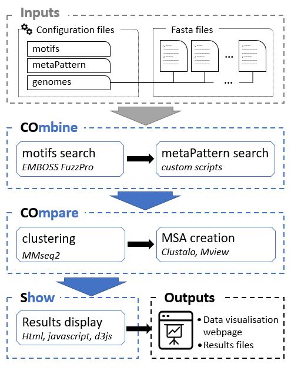
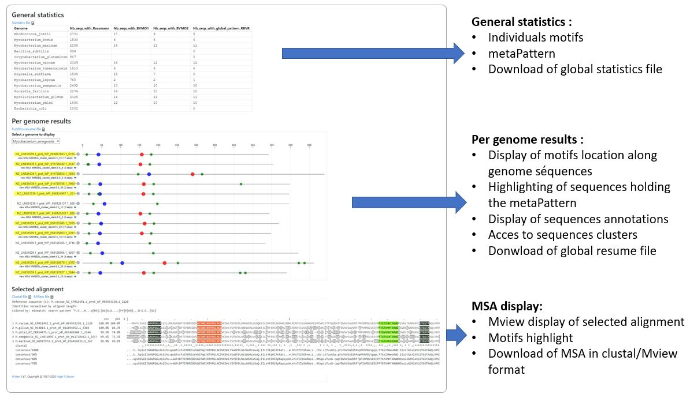

# COSP: COmbine, COmpare and Show Sequences Patterns

COSP is a workflow which identifies in whole genomes motifs that appear in a precise order defining a global pattern (metaPattern).  
Sequences respecting the defined metaPattern are clustered together and a multiple alignment is performed within each cluster.  
All results: individual patterns, metaPattern, clusters, MSA are displayed in a web environment users to explore them.  

This directory is a specific instance of the COSP workflow created to produce the results presented in the publication of Toma et al.
The folowing github page presents the results obtained with the COSP pipeline in the study [Bioinformatic Mining and Structure-Activity Profiling of Baeyer-Villiger Monooxygenases from Mycobacterium tuberculosis, Tomas et al, mSpere 2022](https://doi.org/10.1128/msphere.00482-21)

https://smartbioinf.github.io/BVMO_type1_Tomas_et_al_2021/

## Documentation 

The COSP user guide is available in our [GitHub Wiki](https://github.com/SmartBioInf/COSP/wiki).  
For questions please open an issue on GitHub or ask to Sylvain Marthey.

## Workflow orverview

## Results page Overview

